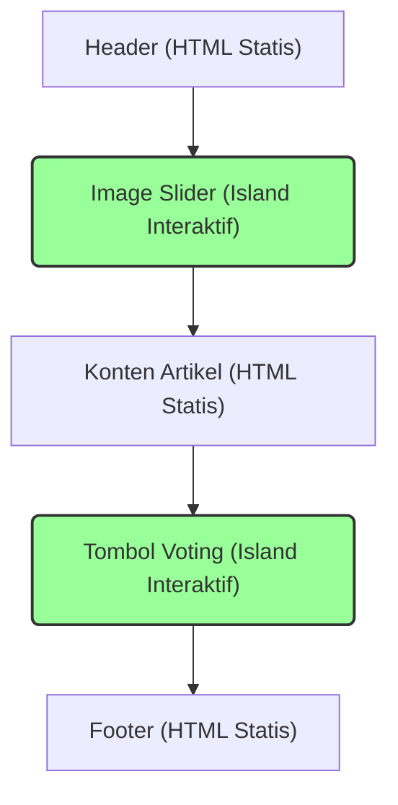

import Tabs from '@theme/Tabs';
import TabItem from '@theme/TabItem';

# Pengenalan Astro - Framework Web untuk Website Berbasis Konten

Catatan ini merupakan ringkasan dari sesi pertama seri Astro JS. Sesi ini membahas perkenalan awal dengan Astro, mulai dari filosofi hingga fitur-fitur utamanya.

## Mengenal Astro

Astro adalah sebuah framework web modern yang menggunakan JavaScript. Kunjungi situs resminya di [astro.build](https://astro.build).

:::info[**Tagline**]
The web framework for content-driven websites.
:::

Artinya, Astro dirancang secara optimal untuk membangun website yang kaya akan konten (content-driven), seperti:

- Blog
- Situs Marketing
- Portal Berita
- E-commerce
- Dokumentasi & Portofolio

Fokus utamanya adalah kecepatan, performa, dan optimasi SEO (Search Engine Optimization).

Untuk memulai proyek Astro, kita bisa menggunakan perintah berikut di terminal:

<Tabs groupId="package-manager">
  <TabItem value="npm" label="npm" default>
    ```bash
    npm create astro@latest
    ```
  </TabItem>
  <TabItem value="pnpm" label="pnpm">
    ```bash
    pnpm create astro@latest
    ```
  </TabItem>
  <TabItem value="yarn" label="yarn">
    ```bash
    yarn create astro
    ```
  </TabItem>
</Tabs>

## Fitur Utama Astro

Berdasarkan halaman utamanya, berikut adalah beberapa pilar dan fitur unggulan yang ditawarkan Astro:

### 1. Server-First

Astro mengutamakan proses rendering di sisi server (Server-Side Rendering). Tujuannya adalah mengirimkan HTML yang ringan ke browser dan meminimalkan pengiriman JavaScript yang tidak perlu, sehingga waktu muat halaman menjadi sangat cepat.

### 2. Content-Driven

Astro didesain untuk terintegrasi dengan konten Anda, dari mana pun sumbernya:

- **File System**: Menulis konten langsung dalam format Markdown (`.md`) atau MDX.
- **External API**: Mengambil data dari API pihak ketiga.
- **Headless CMS**: Terhubung dengan berbagai CMS favorit seperti Strapi, WordPress (headless), dll.

### 3. Arsitektur "Astro Islands"

Ini adalah salah satu konsep paling fundamental di Astro. "Island" atau "Pulau" adalah sebuah pola arsitektur yang memungkinkan performa website yang sangat cepat dengan cara mengisolasi komponen interaktif. Sebagian besar website akan dirender sebagai HTML statis yang cepat, sementara komponen yang butuh JavaScript (seperti image carousel atau tombol interaktif) akan dimuat secara terpisah. Kita akan membahas ini lebih dalam.

### 4. Zero Lock-in (Bebas Menggunakan UI Framework Favorit)

Astro sangat fleksibel. Anda tidak terikat pada satu teknologi UI. Anda bisa membawa dan menggunakan komponen yang sudah ada dari framework populer seperti:

- React
- Vue
- Svelte
- SolidJS

Bahkan, Anda bisa **menggabungkan beberapa framework** dalam satu halaman yang sama karena setiap "island" bekerja secara independen.

```javascript
// Contoh penggunaan komponen dari framework berbeda di Astro
import ReactButton from '../components/ReactButton.jsx';
import VueButton from '../components/VueButton.vue';
import SvelteButton from '../components/SvelteButton.svelte';

<ReactButton />
<VueButton />
<SvelteButton />
```

### 5. Fokus pada Performa

Astro mengklaim memiliki performa _real-world_ yang lebih unggul dibandingkan framework lain berdasarkan data dari HTTP Archive & Chrome UX Report, terutama dalam hal Core Web Vitals yang penting untuk SEO.

---

## Penjelasan Mendalam: Arsitektur Island (Island Architecture)

Ini adalah "nilai jual" utama dari Astro. Mari kita bedah konsepnya.

:::info[**Ide dasarnya sederhana:**]
Render halaman HTML di server, lalu sisipkan "placeholder" di sekitar bagian yang sangat dinamis. Bagian dinamis ini kemudian "dihidupkan" di sisi klien sebagai "pulau-pulau" kecil yang independen.
:::

Ini berbeda dengan pendekatan framework SPA (Single Page Application) pada umumnya yang memuat dan merender seluruh website sebagai satu aplikasi JavaScript besar, yang seringkali memperlambat waktu muat awal.

**Halaman Web di Astro**



### Jenis-jenis Island

Astro membagi "island" menjadi dua jenis utama:

#### 1. Client Islands

Ini adalah komponen UI interaktif yang "dihidrasi" (diberi kemampuan JavaScript) di sisi klien (browser). Anda bisa menganggapnya sebagai "widget" interaktif yang mengapung di lautan HTML statis.

- **Cara Menggunakan**: Cukup tambahkan direktif `client:*` pada komponen Anda.
- **Contoh**: `<ImageCarousel client:load />`

Astro memberikan kontrol penuh kapan JavaScript untuk sebuah komponen harus dimuat:

- `client:load`: Memuat JavaScript komponen segera setelah halaman dimuat.
- `client:idle`: Menunggu browser "santai" (tidak ada pekerjaan berat), baru memuat JavaScript. Berguna untuk komponen prioritas rendah.
- `client:visible`: Memuat JavaScript hanya ketika komponen masuk ke dalam layar (viewport). Sangat efisien untuk konten di bagian bawah halaman (lazy loading).

**Manfaat**: Performa super cepat karena JavaScript hanya dimuat untuk komponen yang benar-benar membutuhkannya, dan hanya saat dibutuhkan.

#### 2. Server Islands

Ini adalah komponen yang kontennya dinamis dan dirender di sisi server pada setiap permintaan. Komponen ini tidak mengirimkan JavaScript ke klien.

- **Cara Menggunakan**: Tambahkan direktif `server:*`.
- **Contoh**: `<UserProfile server:load />`

**Kapan digunakan?**
Sangat cocok untuk konten yang dipersonalisasi atau butuh data terbaru dari server, misalnya:

- Menampilkan nama pengguna yang sedang login.
- Menampilkan isi keranjang belanja.
- Menampilkan data real-time.

**Manfaat**: Konten yang sangat dinamis tidak akan memblokir rendering sisa halaman yang statis. Halaman akan tetap dimuat dengan cepat, dengan _placeholder_ (seperti _loading spinner_) ditampilkan sementara data dinamis disiapkan di server.

## Kesimpulan Sesi 1

Astro adalah framework yang menjanjikan, terutama untuk proyek yang mengutamakan kecepatan dan SEO. Dengan **Arsitektur Island**, Astro menawarkan solusi cerdas untuk masalah performa yang sering dihadapi oleh web modern. Kemampuannya untuk fleksibel dengan berbagai framework UI juga menjadi nilai tambah yang besar.

Di sesi berikutnya, kita akan mulai praktik dengan menginstal Astro dan membuat proyek pertama kita.
