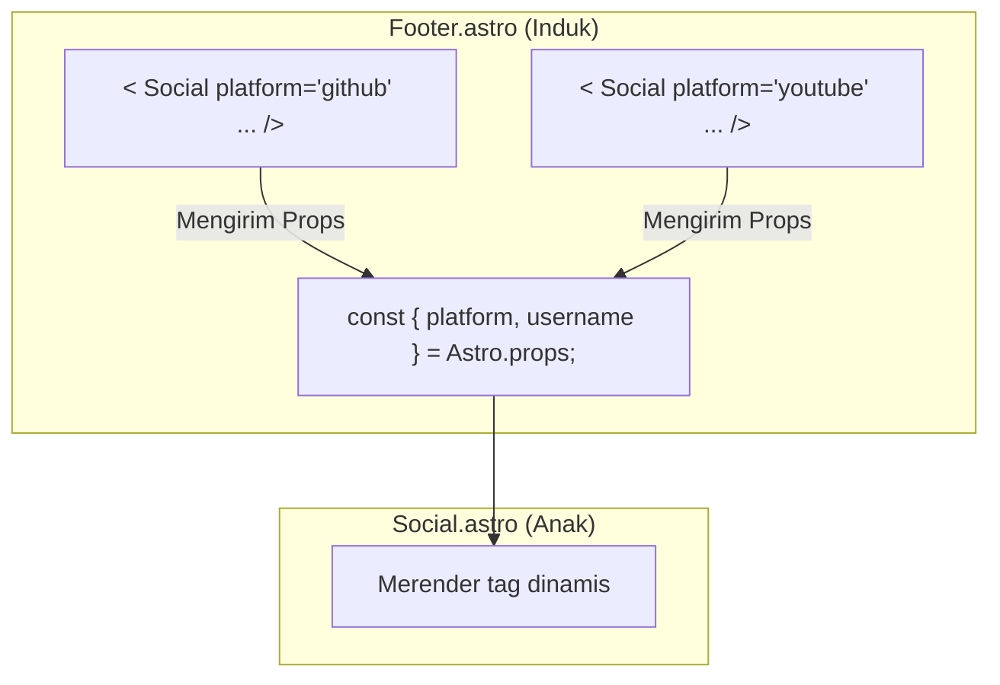

# Kode Reusable dengan Komponen Astro

Setelah membuat beberapa halaman, kita menyadari ada banyak duplikasi kode, terutama pada bagian navigasi dan footer. Sesi ini akan membahas solusi untuk masalah tersebut menggunakan salah satu fitur paling kuat di Astro: **Komponen**.

## 1. Konsep Dasar Komponen

Komponen adalah potongan kecil dari UI (HTML, CSS, dan JavaScript) yang dapat digunakan kembali di berbagai bagian website Anda. Tujuannya adalah mengikuti prinsip **DRY (Don't Repeat Yourself)**.

**Keuntungan menggunakan komponen:**

- **Reusable**: Satu komponen bisa dipakai di banyak halaman.
- **Mudah Dikelola**: Jika ada perubahan (misalnya, menambah link navigasi), Anda cukup mengubah satu file komponen.
- **Kode Lebih Bersih**: Halaman utama menjadi lebih ringkas dan mudah dibaca.

Konsep ini identik dengan yang ada di framework lain seperti React dan Vue.

## 2. Membuat Komponen Pertama: `Navigation.astro`

Mari kita ubah navigasi statis kita menjadi sebuah komponen yang reusable.

### Langkah-langkah:

1.  **Buat Folder `components`**
    Sesuai konvensi, semua komponen yang dapat digunakan kembali disimpan di dalam folder `src/components/`.

2.  **Buat File Komponen**
    Di dalam `src/components/`, buat file baru bernama `Navigation.astro`. Dianjurkan menggunakan huruf kapital di awal nama file untuk membedakannya dari elemen HTML biasa.

3.  **Pindahkan Kode HTML**
    Potong (cut) kode `<nav>...</nav>` dari salah satu halaman Anda (misal, `index.astro`) dan tempelkan (paste) ke dalam file `Navigation.astro`.

    **`src/components/Navigation.astro`**

    ```jsx
    ---
    // Komponen sederhana bisa jadi tidak butuh script sama sekali
    ---
    <nav>
      <a href="/">Home</a>
      <a href="/about">About</a>
      <a href="/blog">Blog</a>
    </nav>
    ```

4.  **Gunakan Komponen di Halaman**
    Sekarang, kembali ke file `index.astro` (dan file halaman lainnya). Hapus kode navigasi yang lama, lalu impor dan gunakan komponen `Navigation`.

    **`src/pages/index.astro`**

    ```jsx
    ---
    import Navigation from '../components/Navigation.astro';
    ---
    <html lang="en">
      <body>
        <Navigation />  <!-- Gunakan komponen seperti tag HTML -->
        <h1>Halaman Utama</h1>
        <!-- ...konten lainnya... -->
      </body>
    </html>
    ```

Lakukan hal yang sama untuk halaman `about.astro` dan `blog.astro` untuk mendapatkan navigasi yang konsisten di seluruh situs.

## 3. Komunikasi Antar Komponen dengan "Props"

Bagaimana jika sebuah komponen perlu menampilkan data yang berbeda setiap kali digunakan? Jawabannya adalah **Props** (kependekan dari _properties_).

Props adalah cara untuk mengirim data dari komponen induk (parent) ke komponen anak (child). Mari kita praktikkan dengan membuat komponen `Footer.astro` yang berisi link media sosial.

### Skenario: Komponen dalam Komponen

Kita akan membuat komponen `Footer.astro` yang akan menggunakan komponen lain bernama `Social.astro` untuk setiap link media sosial.

#### A. Membuat Komponen Anak (`Social.astro`)

Komponen ini bertugas merender satu link sosial. Datanya (platform dan username) akan diterima melalui props.

1.  Buat file `src/components/Social.astro`.
2.  Di dalam _frontmatter script_, kita akses data yang dikirim melalui objek global `Astro.props`.

    ```jsx
    ---
    // Ambil data `platform` dan `username` dari props
    const { platform, username } = Astro.props;
    ---
    <a href={`https://www.${platform}.com/${username}`}>
      {platform}
    </a>
    ```

#### B. Mengirim Props dari Komponen Induk (`Footer.astro`)

Komponen `Footer` akan memanggil komponen `Social` beberapa kali, setiap kali dengan data (props) yang berbeda.

1.  Buat file `src/components/Footer.astro`.
2.  Impor dan gunakan komponen `Social`, lalu kirimkan props seperti atribut HTML.

    ```jsx
    ---
    import Social from './Social.astro';
    ---
    <footer>
      <p>Follow saya di media sosial:</p>
      <div class="social-links">
        <Social platform="github" username="pipcodestudio" />
        <Social platform="youtube" username="pipcodestudio" />
        <Social platform="twitter" username="twitteruser" />
      </div>
    </footer>
    ```

**Diagram alur data props:**



## 4. Styling Komponen

Sama seperti halaman, komponen juga bisa memiliki style sendiri menggunakan tag `<style>`.

- **Scoped by Default**: Gaya yang Anda tulis di dalam komponen hanya berlaku untuk komponen itu sendiri.
- **Fleksibel**: Tag `<style>` bisa diletakkan di mana saja di dalam bagian template, namun meletakkannya di bagian bawah adalah praktik yang umum dan membuat struktur file mirip dengan komponen di Vue.js.

**Contoh `Social.astro` dengan style:**

```jsx
---
const { platform, username } = Astro.props;
---
<a href={`https://www.${platform}.com/${username}`}>{platform}</a>

<style>
  a {
    padding: 0.5rem 1rem;
    color: white;
    background-color: #4c1d95;
    text-decoration: none;
    border-radius: 8px;
  }
</style>
```

## Kesimpulan Sesi 4

Kita telah mempelajari fondasi dari arsitektur berbasis komponen di Astro:

- Membuat komponen reusable untuk bagian UI yang berulang.
- Menggunakan `import` dan tag custom untuk menampilkan komponen.
- Memahami alur data dari komponen induk ke anak menggunakan **props**.
- Menerapkan style yang terisolasi (scoped) di dalam komponen.

Dengan komponen, kita bisa membangun website yang jauh lebih terstruktur, bersih, dan mudah untuk dikelola. Sesi berikutnya akan membahas cara menambahkan interaktivitas menggunakan JavaScript di sisi klien.
