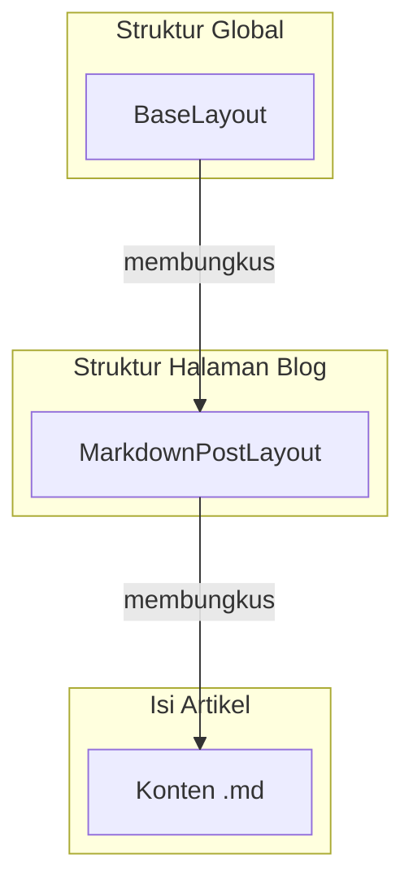

# Layouts - Struktur Halaman yang Konsisten dan Reusable

Di sesi-sesi sebelumnya, kita menyadari bahwa kita harus mengimpor dan menempatkan komponen `<Header />` dan `<Footer />` di setiap halaman secara manual. Ini tidak efisien. Sesi terakhir ini memperkenalkan solusi elegan dari Astro untuk masalah ini: **Layouts**.

Layouts adalah komponen Astro khusus yang dirancang untuk membungkus struktur halaman yang berulang.

## 1. Membuat Layout Dasar (`BaseLayout.astro`)

Layout dasar akan berisi semua elemen yang sama di setiap halaman, seperti `<html>`, `<head>`, serta komponen Header dan Footer kita.

### Langkah-langkah:

1.  **Buat Folder `layouts`**
    Sesuai konvensi, buat folder baru di `src/layouts/`.

2.  **Buat File `BaseLayout.astro`**
    Pindahkan semua kode boilerplate dari salah satu halaman (misalnya `index.astro`) ke dalam file ini.

3.  **Gunakan `<slot />`**
    Di tempat konten unik halaman seharusnya muncul (di antara Header dan Footer), letakkan komponen khusus Astro yaitu `<slot />`. Ini berfungsi sebagai _placeholder_ yang akan diisi oleh konten dari halaman yang menggunakan layout ini.

    **`src/layouts/BaseLayout.astro`**

    ```jsx
    ---
    import Header from '../components/Header.astro';
    import Footer from '../components/Footer.astro';
    import '../styles/global.css';

    // Menerima "title" sebagai prop
    const { title } = Astro.props;
    ---
    <html lang="en">
    <head>
      <meta charset="utf-8" />
      <meta name="viewport" content="width=device-width" />
      <title>{title}</title>
    </head>
    <body>
      <Header />

      <main>
        <!-- Di sinilah konten unik dari setiap halaman akan disuntikkan -->
        <slot />
      </main>

      <Footer />
    </body>
    </html>
    ```

## 2. Menerapkan Layout pada Halaman

Sekarang, kita bisa merapikan file-file halaman kita secara drastis.

1.  Buka file halaman, misalnya `src/pages/index.astro`.
2.  Hapus semua kode boilerplate.
3.  Impor `BaseLayout` dan bungkus konten unik halaman dengan komponen tersebut.
4.  Kirim data yang dibutuhkan oleh layout (seperti `title`) sebagai _props_.

    **`src/pages/index.astro` (Setelah menggunakan Layout)**

    ```jsx
    ---
    import BaseLayout from '../layouts/BaseLayout.astro';
    ---
    <BaseLayout title="Home Page">
      <h1>Selamat Datang!</h1>
      <p>Ini adalah halaman utama dari blog Astro saya.</p>
    </BaseLayout>
    ```

:::tip[**Konsep `<slot />`**]
Slot bukanlah fitur khusus untuk Layouts saja. Komponen Astro apa pun dapat menggunakan `<slot />` untuk menerima dan merender konten anak (_children_), mirip seperti `props.children` di React.
:::

## 3. Layout Khusus untuk Postingan Blog

Postingan blog yang ditulis dalam Markdown memiliki kebutuhan khusus: mereka perlu menampilkan metadata (seperti judul, penulis, tanggal) dari _frontmatter_ YAML mereka. Untuk ini, kita akan membuat layout khusus.

1.  **Buat `MarkdownPostLayout.astro`**
    Di dalam `src/layouts/`, buat file baru ini.

2.  **Akses Frontmatter**
    Di dalam layout yang diterapkan pada file Markdown, kita bisa mengakses semua data frontmatter melalui `Astro.props.frontmatter`.

    **`src/layouts/MarkdownPostLayout.astro`**

    ```jsx
    ---
    const { frontmatter } = Astro.props;
    ---
    <h1>{frontmatter.title}</h1>
    <p>Ditulis oleh: {frontmatter.author} pada {frontmatter.pubDate.slice(0, 10)}</p>
    <hr />
    <!-- Slot untuk konten utama dari file markdown -->
    <slot />
    ```

3.  **Terapkan pada File Markdown**
    Di setiap file `.md` postingan blog, tambahkan kunci `layout` di dalam frontmatter untuk menunjuk ke layout yang baru dibuat.

    **`src/pages/posts/post-1.md`**

    ```yaml
    ---
    layout: ../../layouts/MarkdownPostLayout.astro
    title: "Postingan Blog Pertamaku"
    author: "Aman"
    pubDate: "2025-07-22"
    ---
    Ini adalah isi dari postingan blog saya. Konten ini akan masuk ke dalam `<slot />`...
    ```

## 4. Nested Layouts (Layout di dalam Layout)

Saat ini, halaman postingan blog kita sudah menampilkan metadata dengan benar, tetapi kehilangan Header dan Footer dari `BaseLayout`. Solusinya adalah **Nested Layouts**.

Kita bisa membungkus `MarkdownPostLayout` dengan `BaseLayout`!

**`src/layouts/MarkdownPostLayout.astro` (Versi Final)**

```jsx
---
import BaseLayout from './BaseLayout.astro'; // 1. Impor BaseLayout
const { frontmatter } = Astro.props;
---
<!-- 2. Bungkus semuanya dengan BaseLayout -->
<BaseLayout title={frontmatter.title}>

  <!-- Konten dari layout ini tetap sama -->
  <h1>{frontmatter.title}</h1>
  <p>Ditulis oleh: {frontmatter.author}</p>
  <hr />
  <article>
    <slot />
  </article>

</BaseLayout>
```

Dengan cara ini, kita menciptakan hierarki yang kuat dan efisien:



Hasilnya, halaman postingan blog kita kini memiliki struktur yang konsisten dengan seluruh halaman lain di situs, lengkap dengan Header dan Footer.

## Kesimpulan Seri "Ngulik Astro"

Melalui 6 sesi ini, kita telah melakukan perjalanan dari nol hingga memiliki sebuah situs blog yang fungsional dan terstruktur dengan baik menggunakan Astro.

**Kita telah belajar:**

- Filosofi Astro yang mengutamakan konten dan performa.
- Arsitektur _Island_ untuk interaktivitas yang efisien.
- Routing berbasis file yang intuitif.
- Kekuatan Komponen dan Props untuk kode yang _reusable_.
- Cara menambahkan JavaScript sisi klien.
- Mengelola struktur halaman secara elegan dengan **Layouts**.

Astro terbukti menjadi alat yang sangat kuat dan menyenangkan untuk membangun website modern yang cepat. Selamat mencoba dan teruslah bereksplorasi!
