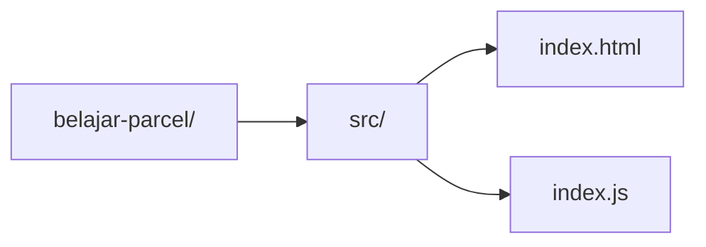

# Pengenalan dan Persiapan Proyek

Selamat datang di catatan Parcel.js! Di sesi perama ini, kita akan berkenalan dengan Parcel dan menyiapkan proyek pertama kita dari nol.

## Apa itu Parcel?

Parcel adalah **bundler aplikasi web** yang dirancang untuk bekerja tanpa perlu konfigurasi (_zero-configuration_). Jika Anda pernah mendengar tentang Webpack, **Parcel** adalah alternatif yang lebih sederhana dan lebih cepat untuk memulai.

### Apa tugas sebuah _bundler_?

Di pengembangan web modern, kita sering menggunakan banyak file (JavaScript, CSS, gambar) dan teknologi canggih (seperti React, TypeScript, Sass). Tugas _bundler_ adalah:

1.  Menggabungkan semua file tersebut menjadi beberapa file statis yang siap dijalankan di browser.
2.  Mengubah (mentranspilasi) kode modern menjadi kode yang dimengerti oleh lebih banyak browser.
3.  Mengoptimalkan ukuran file agar aplikasi berjalan lebih cepat.

Keunggulan utama Parcel adalah kemudahan penggunaannya. Anda bisa fokus membangun aplikasi tanpa menghabiskan banyak waktu untuk mengatur file konfigurasi yang rumit.

## Membuat Struktur Proyek

Pertama, kita akan membuat folder proyek dan beberapa file awal.

1.  Buka terminal Anda dan jalankan perintah berikut untuk membuat direktori proyek:

    ```bash
    mkdir belajar-parcel
    cd belajar-parcel
    ```

2.  Di dalam folder `belajar-parcel`, buat sebuah folder bernama `src` (singkatan dari _source_). Di sinilah kita akan menyimpan kode sumber kita.

    ```bash
    mkdir src
    ```

3.  Buat dua file kosong di dalam folder `src`: `index.html` dan `index.js`.

    ```bash
    touch src/index.html src/index.js
    ```

Struktur folder Anda sekarang akan terlihat seperti ini:



## Mengisi File Awal

Sekarang, mari kita isi kedua file tersebut dengan kode dasar.

1.  Buka file `src/index.html` dan masukkan kode HTML standar berikut. Perhatikan bahwa kita menghubungkan file JavaScript kita (`index.js`) menggunakan tag `<script>`.

    ```html
    <!DOCTYPE html>
    <html lang="en">
      <head>
        <meta charset="UTF-8" />
        <meta name="viewport" content="width=device-width, initial-scale=1.0" />
        <title>Belajar Parcel.js</title>
      </head>
      <body>
        <h1>Halo, Parcel!</h1>

        <script src="./index.js"></script>
      </body>
    </html>
    ```

2.  Buka file `src/index.js` dan tambahkan satu baris kode ini untuk memastikan file kita berjalan.

    ```javascript
    console.log("Skrip JavaScript berjalan!");
    ```

## Menjalankan Parcel untuk Pertama Kali

Dengan file HTML dan JavaScript yang sudah siap, kita bisa langsung menjalankan Parcel tanpa perlu instalasi apa pun menggunakan `npx`.

1.  Di terminal, jalankan perintah berikut:

    ```bash
    npx parcel src/index.html
    ```

    - `npx` adalah alat yang memungkinkan Anda menjalankan paket npm tanpa menginstalnya secara global.
    - `parcel` adalah nama paket Parcel.
    - `src/index.html` adalah **titik masuk** (_entry point_) aplikasi kita. Parcel akan mulai menganalisis dari file ini.

2.  Setelah perintah dijalankan, Anda akan melihat output seperti ini:

    ```
    Server running at http://localhost:1234
    ✨ Built in 1.25s.
    ```

3.  Buka `http://localhost:1234` di browser Anda. Anda akan melihat halaman dengan tulisan "Halo, Parcel!".

    Buka juga _Developer Tools_ (biasanya dengan F12) dan lihat di tab _Console_, Anda akan menemukan pesan "Skrip JavaScript berjalan!".

**Apa yang Terjadi di Latar Belakang?**

Parcel secara otomatis membuat dua folder baru di proyek Anda:

- `.cache`: Folder ini digunakan Parcel untuk menyimpan data sementara agar proses _build_ berikutnya bisa lebih cepat. Anda bisa mengabaikan folder ini.
- `dist`: Singkatan dari _distribution_. Folder ini berisi hasil akhir dari proses _bundling_ yang siap untuk diunggah ke server. Jika Anda membuka `dist/index.html`, Anda akan melihat bahwa tag `<script>` telah diubah untuk menunjuk ke file JavaScript yang sudah dioptimalkan oleh Parcel.

## Instalasi Lokal dan Skrip NPM

Menggunakan `npx` sangat praktis, tetapi untuk proyek sungguhan, lebih baik menginstal Parcel secara lokal. Ini memastikan bahwa setiap orang yang mengerjakan proyek menggunakan versi Parcel yang sama.

1.  Hentikan server Parcel yang sedang berjalan dengan menekan `Ctrl + C` di terminal.

2.  Inisialisasi proyek Node.js untuk membuat file `package.json`. File ini akan melacak semua dependensi proyek kita.

    ```bash
    npm init -y
    ```

3.  Instal `parcel-bundler` sebagai _dev dependency_ (paket yang hanya dibutuhkan selama pengembangan).

    ```bash
    npm install --save-dev parcel
    ```

    Atau bisa disingkat:

    ```bash
    npm i -D parcel
    ```

4.  Sekarang, buka file `package.json` dan tambahkan skrip untuk mempermudah kita menjalankan Parcel. Ganti bagian `"scripts"` dengan kode berikut:

    ```json
    "scripts": {
      "start": "parcel src/index.html",
      "build": "parcel build src/index.html"
    },
    ```

    - **start**: Perintah ini akan menjalankan server pengembangan, sama seperti yang kita lakukan dengan `npx`.
    - **build**: Perintah ini akan membuat versi produksi dari aplikasi kita di dalam folder `dist`, yang sudah teroptimasi dan siap untuk di-deploy.

5.  Untuk menjalankan server pengembangan, kini Anda cukup mengetik:

    ```bash
    npm start
    ```

6.  Untuk membuat file produksi, jalankan:

    ```bash
    npm run build
    ```

Dengan ini, persiapan proyek kita sudah selesai! Di bab berikutnya, kita akan membahas fitur-fitur menarik seperti _Hot Module Replacement_.
