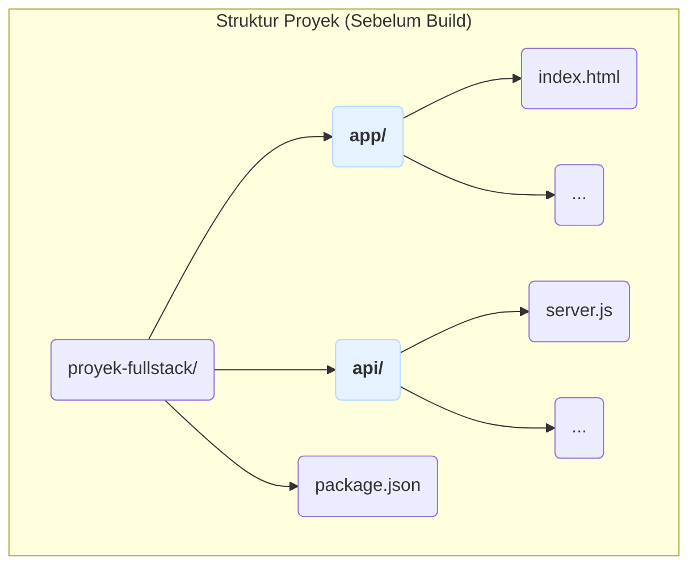
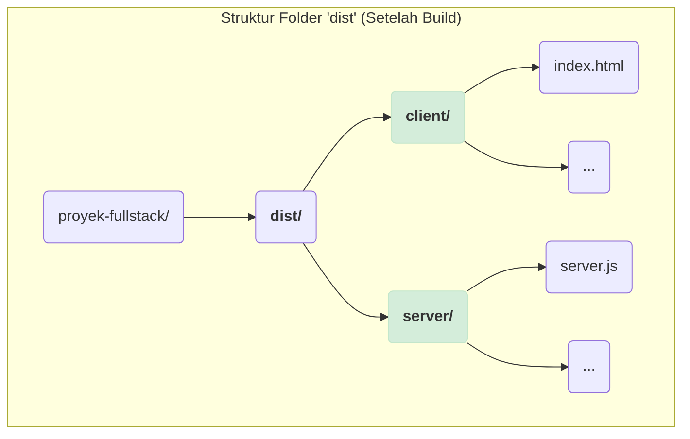

# Mengonfigurasi Target dan Differential Bundling

Konsep "Targets" di Parcel memungkinkan kita untuk mengompilasi kode sumber yang sama dengan berbagai cara berbeda, untuk lingkungan yang berbeda pula, secara bersamaan. Ini adalah fitur yang sangat kuat untuk optimasi dan pengelolaan proyek yang kompleks.

---

## Perbedaan Entry Points dan Targets

Sebelum melangkah lebih jauh, penting untuk memahami perbedaan antara _Entry Points_ dan _Targets_:

- **Entry Points**:

  Ini adalah file **INPUT** tempat Parcel mulai bekerja. Anda bisa menentukannya via CLI (`parcel src/index.html`) atau di `package.json` (`"source": "src/index.html"`). Anda bisa memiliki beberapa _entry points_ (misalnya `home.html` dan `about.html`).

- **Targets**:

  Ini adalah konfigurasi **OUTPUT**. Sebuah _target_ menentukan:

  - **Lingkungan Tujuan**: Apakah kode ini untuk browser, Node.js, atau web worker?
  - **Versi Dukungan**: Browser atau versi Node.js mana yang harus didukung?
  - **Lokasi Output**: Di direktori mana file hasil **build** akan disimpan?

Singkatnya, _Entry Points_ adalah "apa yang di-build", sedangkan _Targets_ adalah "bagaimana cara build-nya".

---

## Menentukan Lingkungan Target dengan `browserslist`

Penggunaan _target_ yang paling umum adalah untuk memberitahu Parcel browser mana saja yang perlu Anda dukung. Ini dilakukan melalui field `"browserslist"` di `package.json`.

```json title="package.json"
{
  "name": "proyek-parcel",
  "version": "1.0.0",
  "source": "src/index.html",
  "browserslist": "> 0.5%, last 2 versions, not dead"
}
```

**Apa arti dari konfigurasi di atas?**

Ini adalah instruksi untuk Parcel agar mengompilasi kode JavaScript dan CSS supaya kompatibel dengan:

- Browser yang memiliki pangsa pasar global di atas 0.5% (`> 0.5%`).
- Dua versi terakhir dari setiap browser utama (`last 2 versions`).
- Browser yang belum "mati" atau tidak lagi didukung (`not dead`).

Dengan menentukan ini, Parcel tidak akan melakukan transpilasi yang tidak perlu, sehingga ukuran _bundle_ untuk browser modern bisa tetap kecil.

## Differential Bundling: Optimasi Otomatis Paling Keren

Ini adalah hasil paling nyata dan mengagumkan dari penggunaan `browserslist`. **Differential Bundling** adalah ide untuk mengirimkan beberapa versi kode ke browser, dan membiarkan browser memilih versi terbaik yang didukungnya.

Jika `browserslist` Anda mencakup browser modern dan browser lama (yang tidak mendukung ES Modules, seperti Internet Explorer 11), Parcel akan melakukan ini secara otomatis.

**Contoh:**
Anda hanya perlu menulis satu baris skrip di `src/index.html`:

```html
<script type="module" src="./index.js"></script>
```

Saat Anda menjalankan `npm run build`, Parcel akan menghasilkan DUA versi bundel dan mengubah HTML di folder `dist` menjadi seperti ini:

```html
<!-- Hasil build dari Parcel -->
<script type="module" src="index.modern.1234.js"></script>
<script nomodule src="index.legacy.5678.js"></script>
```

**Bagaimana ini bekerja?**

- **Browser Modern**: Akan mengunduh dan menjalankan skrip `type="module"` yang berisi kode ES6+ modern (lebih kecil, lebih cepat). Ia akan mengabaikan skrip `nomodule`.
- **Browser Lama**: Tidak mengerti `type="module"`, jadi ia akan mengabaikannya. Sebaliknya, ia akan mengunduh dan menjalankan skrip `nomodule` yang berisi kode ES5 yang sudah ditranspilasi sepenuhnya (lebih besar, tapi kompatibel).

Ini adalah cara terbaik untuk mendukung browser lama tanpa mengorbankan performa bagi pengguna dengan browser modern.

---

## Konfigurasi Multi-Target di `package.json`

Untuk skenario yang lebih kompleks, Anda bisa mendefinisikan beberapa _target_ secara eksplisit di `package.json`. Misalnya, Anda sedang membangun aplikasi full-stack dan ingin mem-build kode _frontend_ dan _backend_ secara bersamaan.

Diasumsikan, anda memiliki struktur proyeknya seperti ini :



```json title="package.json"
{
  "source": false, // Matikan source utama jika sudah didefinisikan di dalam target
  "targets": {
    "frontend": {
      "source": "app/index.html",
      "distDir": "dist/client",
      "publicUrl": "/"
    },
    "backend": {
      "source": "api/server.js",
      "distDir": "dist/server",
      "context": "node",
      "engines": {
        "node": ">= 16"
      }
    }
  }
}
```

**Penjelasan:**

- `targets`: Kunci utama untuk mendefinisikan beberapa target.
- `frontend` & `backend`: Ini adalah nama kustom yang kita berikan untuk setiap target.
- `source`: Setiap target bisa memiliki _entry point_ yang berbeda.
- `distDir`: Setiap target bisa memiliki direktori output yang berbeda.
- `context`: Ini secara eksplisit memberitahu Parcel bahwa target `backend` harus di-build untuk lingkungan `"node"`, bukan `"browser"`.
- `engines`: Kita bisa menentukan versi Node.js yang didukung untuk target `backend`.

**Setelah di build struktur foldernya seperti ini :**



Dengan konfigurasi ini, satu perintah `npm run build` akan menghasilkan `dist/client` untuk frontend dan `dist/server` untuk backend. Ini sangat efisien untuk mengelola proyek monorepo atau full-stack.
