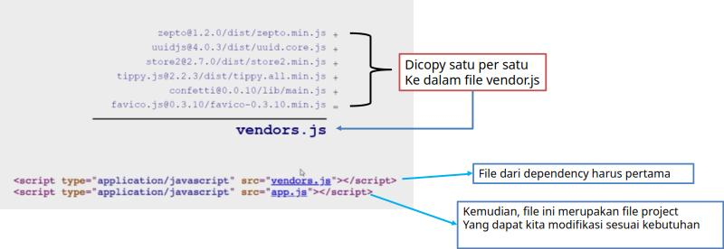

# Pengenalan Webpack

## Apa itu Webpack?

Webpack adalah sebuah **_module bundler_** untuk aplikasi JavaScript modern. Sederhananya, bayangkan Anda sedang membangun sebuah proyek web yang kompleks. Proyek Anda mungkin terdiri dari puluhan atau bahkan ratusan file: file **JavaScript**, file **CSS**, **gambar**, **font**, dan lain-lain.

**Webpack bertugas mengambil semua file tersebut, memprosesnya, dan "menggabungkannya" (bundle) menjadi beberapa file statis yang siap digunakan oleh browser.**

Selain Webpack, ada banyak **_module bundler_** lain seperti **Vite**, **Parcel**, dan **Rollup**. Kita tahu, **_module bundler_** yang disebutkan sebelumnya memiliki kemampuan yang bagus. Namun, **Webpack** adalah salah satu yang paling populer dan kuat, dengan ekosistem yang sangat besar.

## Mengapa Webpack Diperlukan?

Di masa lalu, sebelum era **_module bundler_**, para _programmer_ menghadapi beberapa tantangan:

1.  **Manajemen File JavaScript yang Rumit:** Kita harus memuat banyak file JavaScript menggunakan tag `<script>` di file HTML. Urutan pemuatan file ini sangat penting; jika salah urut, aplikasi bisa rusak. Bayangkan jika Anda punya 7 _library_ JavaScript, maka akan ada 7 _request_ ke server hanya untuk memuat file-file tersebut.

    

2.  **Penggabungan Manual:** Solusi lain adalah menggabungkan semua kode dari berbagai _library_ ke dalam satu file besar (misalnya `vendors.js`). Proses ini merepotkan, manual, dan rentan kesalahan.

    

3.  **Masalah Lainnya:**
    - Bagaimana jika ada pembaruan (update) pada salah satu _library_? Kita harus mengulang proses penggabungan manual.
    - Bagaimana jika satu _library_ bergantung pada _library_ lain (_dependencies_)? Mengelola ini secara manual sangat sulit.

## Solusi: Module Bundler

_Module bundler_ seperti Webpack datang untuk menyelesaikan semua masalah ini. Dengan Webpack, kita bisa:

- **Mengelola dependensi secara otomatis:** Cukup gunakan `import` atau `require` di dalam kode Anda, Webpack akan mengurus sisanya.
- **Menggabungkan file secara cerdas:** Webpack akan membuat _dependency graph_ (grafik ketergantungan) untuk memahami hubungan antar file dan menggabungkannya secara efisien.
- **Melakukan optimasi:** Webpack bisa melakukan _minify_ (menghapus spasi dan karakter tidak perlu) dan _uglify_ (mengubah nama variabel menjadi pendek) pada kode agar ukuran file menjadi lebih kecil dan aplikasi berjalan lebih cepat.
- **Memproses berbagai jenis file:** Dengan bantuan _Loaders_, Webpack tidak hanya bisa memproses JavaScript, tapi juga CSS, SASS, gambar, dan banyak lagi.
