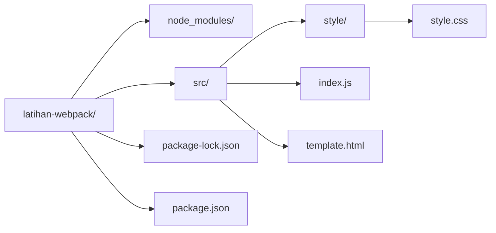
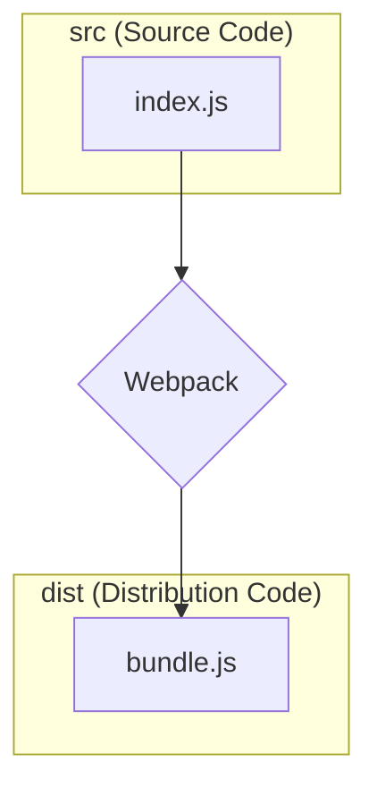

# Konfigurasi Dasar

Mari kita coba membuat proyek sederhana menggunakan Webpack.

## Inisialisasi Proyek

Pertama, buat sebuah folder baru misalnya `latihan-webpack`. Buka terminal di dalam folder tersebut, dan jalankan perintah berikut untuk membuat file `package.json`.

```bash
npm init -y
```

## Instalasi Webpack

Sekarang, install `webpack` dan `webpack-cli` sebagai _dev dependencies_ (paket yang hanya dibutuhkan selama proses development).

```bash
npm install webpack webpack-cli --save-dev
```

Setelah instalasi selesai, file `package.json` Anda akan terlihat seperti ini:

```json
{
  "name": "latihan-webpack",
  "version": "1.0.0",
  "description": "",
  "private": true,
  "scripts": {
    "test": "echo \"Error: no test specified\" && exit 1"
  },
  "keywords": [],
  "author": "",
  "license": "ISC",
  "devDependencies": {
    "webpack": "^5.74.0",
    "webpack-cli": "^4.10.0"
  }
}
```

## Struktur Proyek

Secara _default_, Webpack akan mencari file _entry point_ (titik masuk) di `src/index.js`. Mari kita buat struktur folder dan file sederhana seperti ini untuk proyek jam digital kita:



## Menulis Kode

Isi file-file yang baru kita buat:

**`src/template.html`**

```html
<!DOCTYPE html>
<html lang="en">
  <head>
    <meta charset="UTF-8" />
    <meta http-equiv="X-UA-Compatible" content="IE=edge" />
    <meta name="viewport" content="width=device-width, initial-scale=1.0" />
    <title>The Webclock</title>
    <link rel="stylesheet" href="./style/style.css" />
  </head>
  <body>
    <div class="clock">
      <span class="time"></span>
      <span class="date"></span>
    </div>
    <!-- Kita akan mengisi src ini nanti secara otomatis -->
    <script src=""></script>
  </body>
</html>
```

**`src/index.js`**
Untuk proyek ini, kita akan menggunakan _library_ `jquery` dan `moment`. Pertama, kita perlu menginstalnya.

```bash
npm install jquery moment
```

Kemudian, tulis kode berikut di `src/index.js`:

```javascript
import $ from "jquery";
import moment from "moment";

const displayTime = () => {
  moment.locale("id");
  $(".time").text(moment().format("LTS"));
  $(".date").text(moment().format("LL"));
};

const updateTime = () => {
  displayTime();
  setTimeout(updateTime, 1000);
};

updateTime();
```

## Menjalankan Webpack

Untuk menjalankan Webpack, kita perlu menambahkan sebuah _script_ di `package.json`.

```json
// package.json
"scripts": {
  "build": "webpack"
},
```

Sekarang, jalankan perintah berikut di terminal:

```bash
npm run build
```

Webpack akan mulai bekerja, menganalisis `src/index.js`, mencari semua `import` (yaitu `jquery` dan `moment`), dan menggabungkan semuanya menjadi satu file. Anda akan melihat sebuah folder baru bernama `dist` dibuat, yang berisi file `main.js`.

File `main.js` inilah yang disebut _bundle_, siap untuk digunakan di browser.

## Konsep Inti Webpack

Dari proses di atas, kita telah menyentuh beberapa konsep inti Webpack:

- **Entry:** Titik awal dari mana Webpack memulai proses _bundling_. Secara _default_ adalah `./src/index.js`.
- **Output:** Di mana Webpack akan menyimpan hasil _bundle_-nya. Secara _default_ adalah `./dist/main.js`.
- **Mode:** Bisa diatur menjadi `development`, `production`, atau `none`. Jika tidak diatur, _default_-nya adalah `production` dan Webpack akan memberikan peringatan. Mode ini menentukan jenis optimasi yang akan dijalankan.

Berikut adalah diagram sederhana yang menggambarkan alur kerja dasar Webpack:


